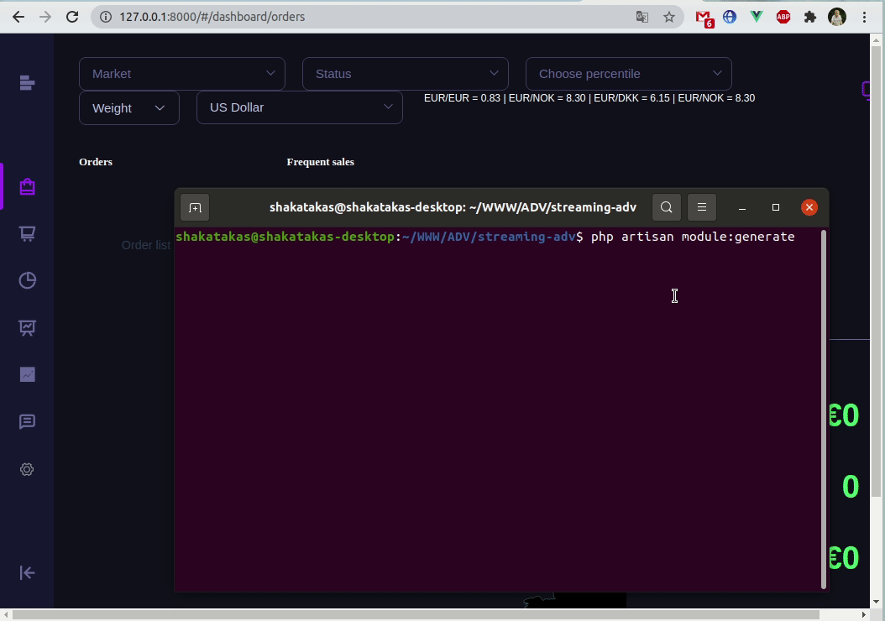

# Modules
```shell
php artisan module:generate
php artisan module:publish
```


After delete module from project run
```shell
php artisan module:publish // That remove broken symlinks
```


Style Guide of module::
- Naming of CamelCase
- Custom logers setup in modules\%module name%\config\logging.php 
- located settings locate on modules\%module name%\config (settings.json included on %modulename%.php)
- ~~Config file - underscore?~~
- ~~Test - todo~~
- ~~Migrations - todo~~
- events like in existing modules:routes/channels.php, Events/{Name}Event.php, js/element/events.js 

### Usage or extending base classes (Repositories/Services) - not be modify core app for module functional
For example need adding method saveAndSendBroadcast, we extending:
App\ClickHouse\Service\BaseFeedbackService -> Modules\Feedbacks\ClickHouse\Service\FeedbackService
Repositories same - app\...\BaseMarketingRepositories -> Module\...\MarketingRepositories

Clickhouse Queries only extends from  QuickQuery and use for params QueryHelper

Controllers responses only return response()->json(...) or return new {Name}Resource(...);


Handle events?
Create EventService provider and register on config/app.php:
```php
<?php

namespace Modules\MarketingOverview\Providers;

use Illuminate\Foundation\Support\Providers\EventServiceProvider as ServiceProvider;
use Illuminate\Support\Facades\Event;
use Modules\MarketingOverview\Events\MarketingOverviewModifiedEvent;

class EventServiceProvider extends ServiceProvider
{
    public function boot()
    {
        Event::listen([
            'ClickHouse.Insert.MarketingExpense',
            'Doctrine.Insert.Order',
            'Doctrine.Update.Order',
        ], function() {
            MarketingOverviewModifiedEvent::broadcast();
        });
    }
}

```

Clickhouse provided events: ClickHouse.Insert.{EntityName} - without data
Doctrine provided events: Doctrine.(Insert.Update).{EntityName} - without data
