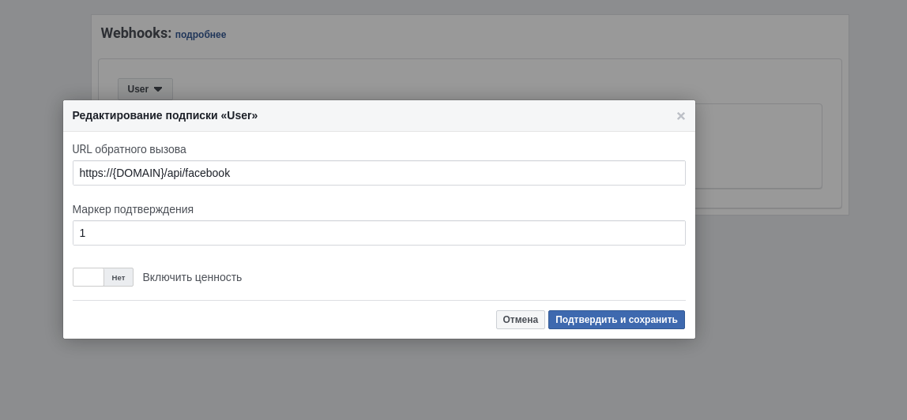
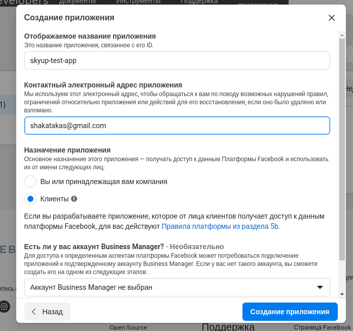

### Facebook configuration

##Для вебхуков:
####Подключаем страницу к приложению

https://developers.facebook.com/docs/graph-api/webhooks/getting-started/webhooks-for-pages#set-up-endpoint-and-product подключить страницу к приложению
#### Добавляем вебхуки в странице приложения
https://developers.facebook.com/apps/{ app id }}/webhooks/ добавить вебхук на {domain}/api/facebook для "page" и подписатся на событие feed
####Как выглядит форма подписки в целом

#### Выбираем page

#### После подтверждения вебхука подписываемся на событие


Положить все в корень проекта в in modules/Feedbacks/config/facebook_webhooks_config.json
```json
{
    "page" : { // Тип вебхука, в дальнейшем возможны другие помимо page
        "feedback_pages": { // Конкректная переменная которая используется в app/Services/Facebook/Webhooks/PageWebhook.php
            "{page id}" : { // ID страницы с которой хандлить комменты в фидбеки
                "source_remote_id": { source remote id },
                "market_remote_id": { market remote id }
            },
            ...
        }
    }
}

```


##Для Api:
Процессинг фидбеков через апи как альтернатива (расчитано на почасовую работу т.к. лимиты апи запросов весьма не весьма).
При первом запросе рекламные аккаунты кешатся на 3 часа сами же объявления на 2, комментарии не кешатся т.к. их обрабатывать надо.
Временное промежуток именно такой так как лимит обновляется +- раз в час. Такой себе failback что на 3й час скорее всего все таки удастся запроцессить комментарии.

1. Go to https://developers.facebook.com/apps/ and touch "Create app"

2. Fill form and submit

3. To main options

4. And we taked id and secret of app (FB_ID, FB_SECRET)

5. For getting long term token FB_TOKEN go to https://developers.facebook.com/tools/explorer/ and copy token

* Go to https://developers.facebook.com/tools/debug/accesstoken/
* past that token
* debug
* renew access token
* copy new token

6. For getting id of ad account go to https://www.facebook.com/ads/manager/accounts/


https://developers.facebook.com/apps/{appId}/settings/advanced/
Рекламные аккаунты
Вписать 
- Идентификаторы авторизованных рекламных аккаунтов
- перечень маркетинговых аккаунтов с пункта 6


Положить все в корень проекта в facebook_applications_config.json
```json
[
    {
        "id" : "{app id}",
        "secret" : "{app secret}",
        "token" : "{app token}",
        "source_remote_id": 1,
        "market_remote_id": 1
    },
    ...
]

```

How to start?
```shell
php artisan fb:sync:feedbacks

```

