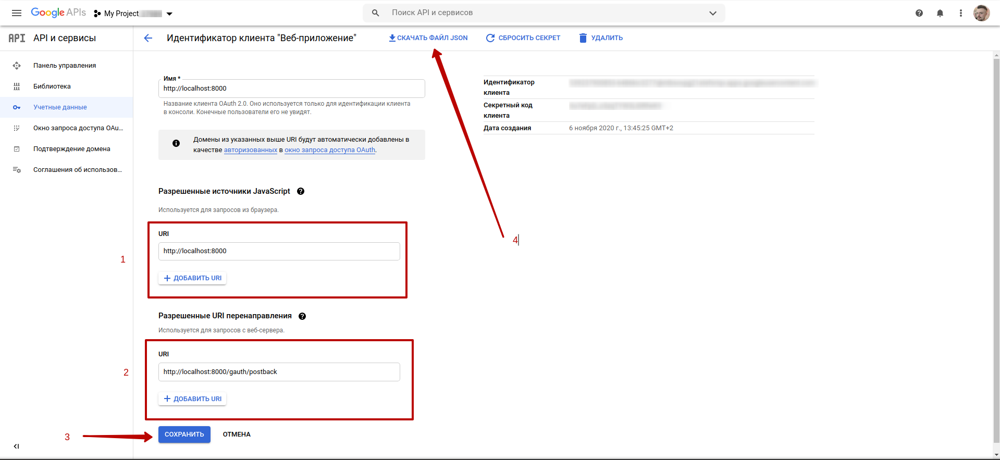

# Google integration
### Google Auth
To create Google API key go to the https://console.developers.google.com/apis/credentials then
 and 
**Then rename downloaded file** to `google_api_config.json` and place it into the project root folder
