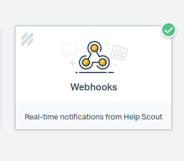
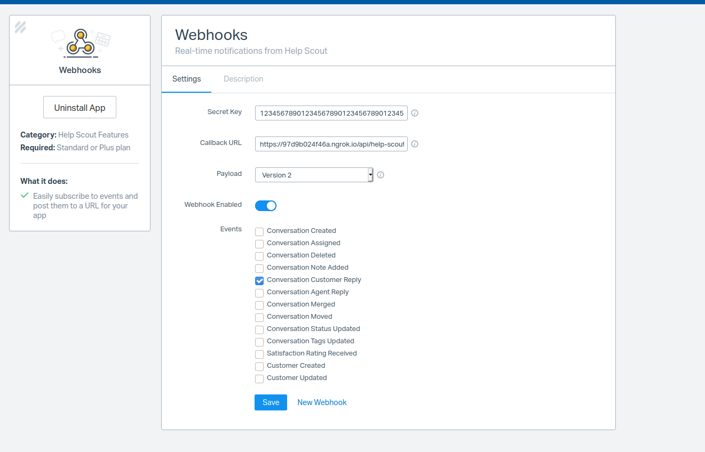
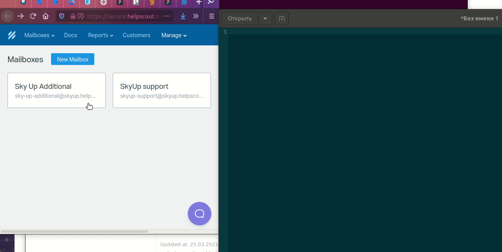

# Help Scout integration

1. Register or sign in on https://www.helpscout.com/

2. Create webhook app https://secure.helpscout.net/apps/ 

2.1. Select that app 


2.2. Configure that like a screenshot 



3. Configure application config

3.1. Go to https://secure.helpscout.net/settings/mailboxes/ and get all ids of mailboxes by his urls  


3.2. Make file `helpscout_config.json` in modules/Feedbacks/config and fill by existing ids

Where key "244356" - mailbox id, 1 - remote market id
```json
{
    "1111111111111": 1, // that mailbox id only for testing application

    "244356": 1,

    "244154": 2

}
```

3.3. Put to .env file some settings
```dotenv
HELPSCOUT_SECRET={secret from 2.2 step}
HELPSCOUT_REMOTE_SOURCE_ID={Remote source id of helpscout, by seed data that 5}
```
and
```shell
php artisan config:clear
```

4. Look logs in storage/logs/helpscout-webhook.log
