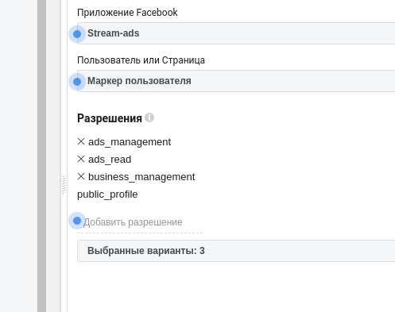
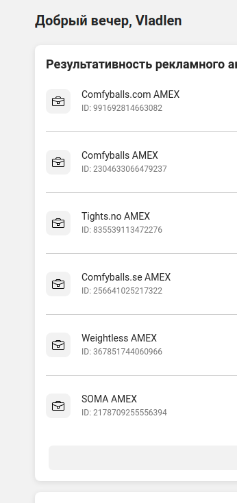

# Facebook Ads sync integration
### Prepare account
1. Process of getting token like same * [Facebook Feedback integration](../../../Integrations/FacebookFeedback/index.md)
2. Only need make token with permissions:
   
3. Take ids of AD accounts
   
4. Create "marketing_facebook.json" file on the root application folder, fill them like example, one item - one account, client id and secret may be duplicated with another account id

```json
[
    {
        "timezone": "Europe/Berlin",
        "token": "EAACFIIzI7ZAJeucoAZBviJuOpnQycSdOKY7hs4geNpbnA0c8TDc5Qab0RByasZB3z5c2Hb8uBvCZAJL05ELVJlhUZBNZAFAUc7gyQYvW4RkxNMEiZBfFmsModJHLZCATcfgwxoB0d5pMYqaT6ewS5Eip3JZBssIEhp4dFhFY2TdBoU0PqjshvPXVypfSUDCuk1uSsZAa2idm8OmZA44YibVcilmwHlRlbKusZAMZD",
        "act_id": "2304633066479237",
        "currency_id": 1,
        "market_remote_id": 1,
        "marketing_channel_id": 2
    },
    {
        "token": "EAACFIIzI7ZAgyutBfEVVOcoAZBviJuOpnQycSdOKY7hs4geNpbnA0c8TDc5Qab0RByasZB3z5c2Hb8uBvCZAJL05ELVJlhUZBNZAFAUc7gyQYvW4RkxNMEiZBfFmsModJHLZCATcfgwxoB0d5pMYqaT6ewS5Eip3JZBssIEhp4dFhFY2TdBoU0PqjshvPXVypfSUDCuk1uSsZAa2idm8OmZA44YibVcilmwHlRlbKusZAMZD",
        "act_id": "835539113472276",
        "currency_id": 1,
        "market_remote_id": 2,
        "marketing_channel_id": 2
    }
]

```
