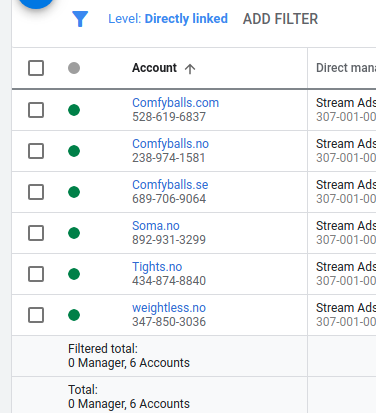

# Google Ads sync integration
### Pre-install
* https://github.com/grpc/grpc/tree/master/src/php

### Prepare accounts
1. https://support.google.com/google-ads/answer/7459399
2. Take access from companies to MCC account
3. Request token https://services.google.com/fb/forms/newtoken/ 
4. Register service account on google console
5. Register 0Auth for desktop application * https://github.com/googleads/google-ads-php/wiki/OAuth-Web-Application-Flow
5.1 https://github.com/googleads/google-ads-php/blob/master/examples/Authentication/AuthenticateInDesktopApplication.php getting refresh token 
7. Take all account ids from main dashboard, after redirect from mcc login page
   
8. Create "marketing_google.json" file on the root application folder, fill them like example, one item - one account, client id and secret may be duplicated with another account id
```json
[
    {
        "timezone": "Europe/Kiev",
        "currency_id": 1,
        "market_remote_id": 1,
        "marketing_channel_id": 2,
        "account_id": "4348748840",
        "developerToken": "HXXAL12cMoHrdQ",
        "loginCustomerId": "3070010035",
        "clientId": "231588726736-f56dldquebqa460oquu1a.apps.googleusercontent.com",
        "clientSecret": "CsbUD6dGAcTaschzjCLFZm",
        "refreshToken": "1//03HjzSEn2pEP9Ir57n15duuQgwI frSiAVRFUywqnr68_heU-9u3lh922sZahYXU1BGfRokQs"
    }
]

```
