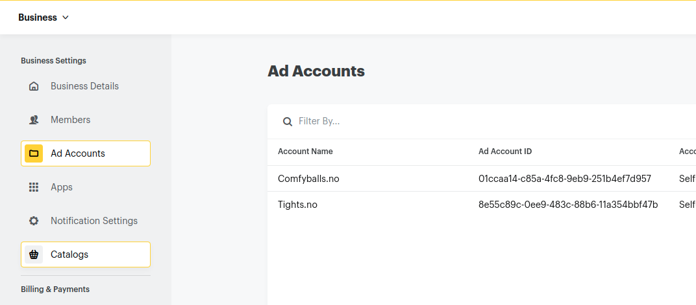

# Snapchat Ads sync integration
## ATTENTION, DO NOT USE THAT CREDENTIALS ON OTHER APPS
## First step
1. Login to https://business.snapchat.com
2. Go to Business Detail
3. Create OAuth App
4. Take client/secret of application, url, redirect set so https://stream.nhgdev.xyz/
5. Run console application command
```shell
php artisan marketing:snapchat:get-token
```
6. Follow the steps


   


7. Get account id

8. Create "marketing_snapchat.json" file on the root application folder, fill them like example, one item - one account, client id and secret may be duplicated with another account id
```json
[
    ...
    {
        "timezone": "Europe/Berlin",
        "client_id": "4d6547b6-99db-40d6-ba15-c75247e7d67c",
        "client_secret": "41fad331a6d151e78e0d",
        "access_token": "eyJpc3MiOiJodHRwczpcL1wvYWNjb3VudHMuc25hcGNoYXQuY29tXC9hY2NvdW50c1wvb2F1dGgyXC90b2tlbiIsInR5cCI6IkpXVCIsImVuYyI6IkExMjhDQkMtSFMyNTYiLCJhbGciOiJkaXIiLCJraWQiOiJhY2Nlc3MtdG9rZW4tYTEyOGNiYy1oczI1Ni4wIn0..Q3ICpNPVnR18P-1y6dQK7w.N58oAP8PQGPiTV1Ce_GEfnDET3nY91lg9eVny_LFaFTi_8PXLDE4i0nxzEJP7iZKZq7RFuec1p4_hFFiwVS4WpYFZ7GT8GKZwXdOmHn5SoP-AWrDGen2N18g1kpwuRROpByli8B0oIMh3v-NBOO7b0FKkGlapBwysU4koh-xaGTa6Fx4eSHVEzP24WW13cAY-ts5ucw8_lajOJ7D_CdQF5GYmynbgTu30bl6CaGwRyQH0WU8XbstXqXXkilYyQ00o9iomWYJ-npk2nyivFKHqo9PYuaQ9ye9HYmqgdh0mwDUggU_Xn2PLpEjWI0xcPQdm7iMQh-bQ4C-ZVtk1Z-Stp1njU77_TraJEZ38A4hb_3ktiI1iJWvDYQHZNY8FOmpjuSJGum4lQgx5Fqe7YayndKx_td6cNc-Tw9AW99Y4i_FmDjqyV0EKgZowNzYgYjxVEzV9cLJMC9lc_InA8lrcrJvkB5pjiPamzKuFieJWsE6PRt5IwcfJjsPyaErEjgvZ0zWgiVWe-TlD8PidMBum3owHCHg0dbfEhxoJdKqP3fZeWqA8QwgEMoZHBJiaAUWbi9bvbXeaTfRxVP4DO9xwelB2GWA1kTrOLCuIdDU7MH3z5uIjRNYKYEC1PEr-NXOAEp9Ojw4Mi_2HavUXRxNNUYRY6paOkSqZHq7S30-i4IUVWEg2BqMBsqIMCcgrOKHFQxftJfVIecm7UkXL9z13-MfWpNnkbz7LWBSjwX4ouI.IpVKLL8VOEmKj7PdOPtRfg",
        "refresh_token": "eyJraWQiOiJyZWZyZXNoLXRva2VuLWExMjhnY20uMCIsInR5cCI6IkpXVCIsImVuYyI6IkExMjhHQ00iLCJhbGciOiJkaXIifQ..8jC3PnoLoSs4LelX.vIPyskmQyb5G_EvG85XAFG0O-pff1WBjYT7lW5ldv-WemGjcTNz0_HfMju62jwfRDq2oET0Co2-5C8dM5ssYgpHGq5pS3YZp_Gs8sRav3Xre6FYNOE1eZqP5TgWO-ratPM7tZDabK8zKkd0GU4fW1AkCejvfl_3Y25ql6kdMrgAZ-41Yrao6rpaPoOC2SA12arzxwonQ8PmqjpB4eRg6sJlgaunQDhdUqOYqOdXPsO2mwa53Tkurz6wob5PMfNRQx8a-_O9Fc_38fBw.zXCTwAAfXKPoWXgjIO8_9g",
        "ad_account_id": "01ccaa14-c85a-4fc8-9eb9-251b4ef7d957",
        "currency_id": 1,
        "market_remote_id": 1,
        "marketing_channel_id": 1
    }
]
```

## Troubleshooting
### Logs
See logs on that path storage/logs/marketing-overview.log

### If app cannot be authorize requests
Need taking a new token
```shell
php artisan marketing:snapchat:get-token
php artisan marketing:snapchat:clear
```
### If you wanna actual access_token and refresh token?
```shell
php artisan marketing:snapchat:credentials
```
